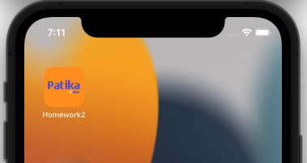

# FMSS-Homework-2

## Description

- Bootcamp News
- First ViewController contains a collectionView
- Second ViewController contains detail about each news
- Third ViewController contains a webKit for the bootcamp page's link

---

    </img>

---

    </img></img>

---

    

    </img></img>

    

---

## Tools
- Swift
    - Delegate Pattern
    - WebKit
- UIKit

